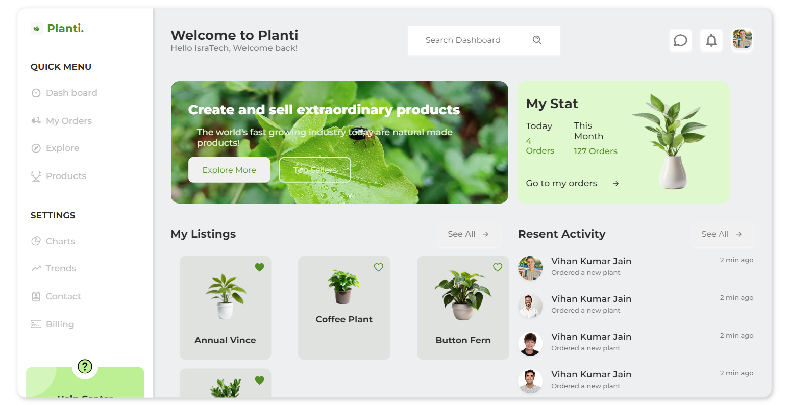

# 🌿 Green Dashboard

**Green Dashboard** is a responsive, aesthetically pleasing React-based dashboard layout designed for plant-related data visualization and user interactions. This project serves as a demonstration of front-end development skills with a focus on React, HTML, CSS, and SCSS (Sass). The dashboard includes various components like a sidebar, stats panel, listings, and recent activity section.



---

## 📑 Table of Contents

- [About the Project](#about-the-project)
- [Features](#features)
- [Built With](#built-with)
- [Getting Started](#getting-started)
- [Usage](#usage)
- [Folder Structure](#folder-structure)
- [Contributing](#contributing)
- [License](#license)
- [Contact](#contact)

---

## 📝 About the Project

Green Dashboard is a demo dashboard layout intended for projects focused on managing plant or product data. It contains no background jobs or complex scripts yet, making it an ideal starting point for further development or customization. This project showcases a clean and modern design with a responsive layout that adapts well to various screen sizes.

---

## ✨ Features

- **Responsive Design**: Adjusts layout smoothly across devices of various sizes.
- **Clean and Modern UI**: Utilizes a minimalist design for better user experience.
- **React Components**: Organized and reusable components.
- **Sass Styling**: SCSS used for easier and more manageable CSS.
- **Component-Based Structure**: Modularized for better maintainability.

---

## 🛠 Built With

- **React.js** - JavaScript library for building user interfaces
- **HTML5** - Markup language for structuring content
- **CSS3** - Cascading Style Sheets for styling
- **Sass (SCSS)** - CSS preprocessor for writing clean and manageable styles

---

## 🚀 Getting Started

To get a local copy up and running, follow these simple steps.

### Prerequisites

- **Node.js** (v12 or higher) and **npm** installed on your machine.
- A modern web browser to view the dashboard.

### Installation

1. **Clone the repository**:
   ```bash
   git clone https://github.com/callmekirankumar/greendashboard